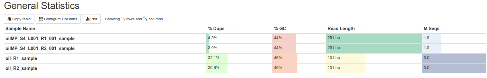
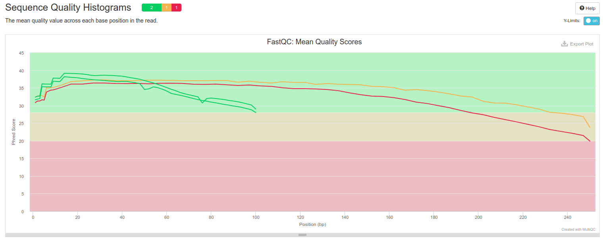
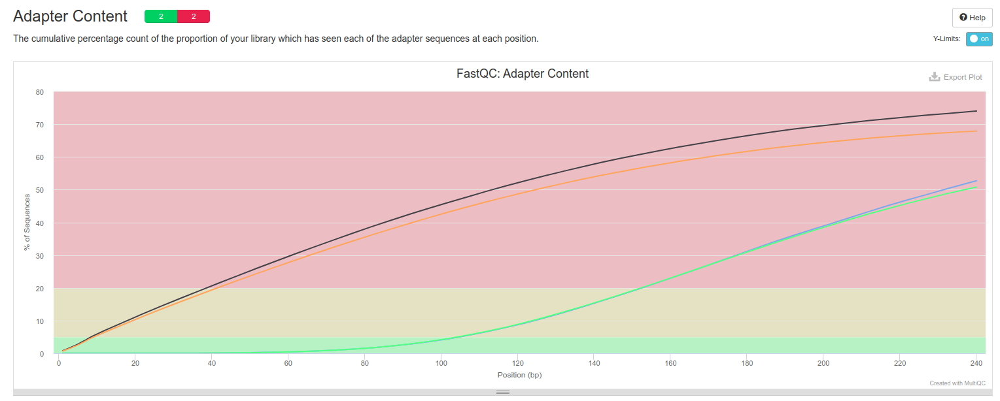
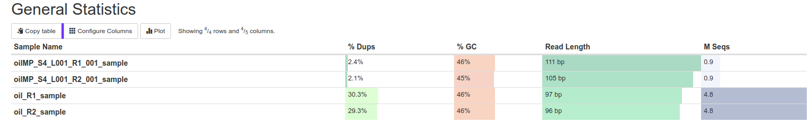
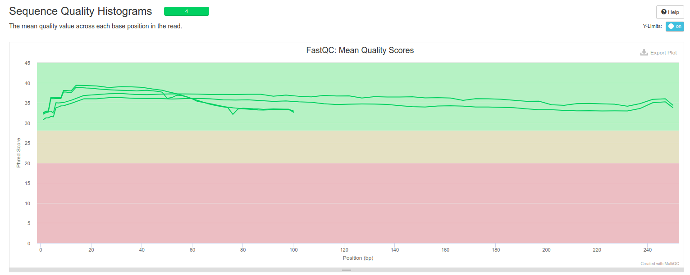
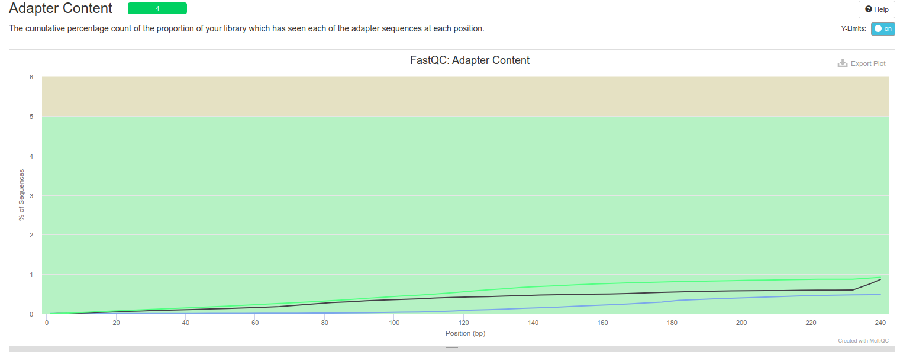

# Сборка генома

## Команды
- ```seqtk sample -s 615 oil_R1.fastq 5000000 > oil_R1_sample.fastq```
- ```seqtk sample -s 615 oil_R2.fastq 5000000 > oil_R2_sample.fastq```
- ```seqtk sample -s 615 oilMP_S4_L001_R1_001.fastq 1500000 > oilMP_S4_L001_R1_001_sample.fastq```
- ```seqtk sample -s 615 oilMP_S4_L001_R2_001.fastq 1500000 > oilMP_S4_L001_R2_001_sample.fastq```
- ```fastqc *_sample.fastq```
- ```multiqc .```
- ```./platanus_trim oil_R1_sample.fastq oil_R2_sample.fastq```
- ```./platanus_internal_trim oilMP_S4_L001_R1_001_sample.fastq oilMP_S4_L001_R2_001_sample.fastq```

- ```mkdir before_cutadapt; mv multiqc_data_1 before_cutadapt/; mv multiqc_report_1.html before_cutadapt/; mv *.zip before_cutadapt/; mv *.html before_cutadapt/```

- ```fastqc *trimmed```
- ```multiqc oilMP_S4_L001_R1_001_sample.fastq.int_trimmed_fastqc.zip oilMP_S4_L001_R2_001_sample.fastq.int_trimmed_fastqc.zip oil_R1_sample.fastq.trimmed_fastqc.zip oil_R2_sample.fastq.trimmed_fastqc.zip```

- ```mkdir after_cutadapt; mv multiqc_data after_cutadapt/; mv *.zip after_cutadapt/; mv *.html after_cutadapt/```

- Авторы не рекомендуют использовать mate-pair риды наряду с pair-end ридами из-за присутствия химерных (искуственно соединённых) ридов в mate-pair последовательностях.
- ```./platanus assemble -o bacteria -f *.fastq.trimmed -t 8 -m 11```
- ```./platanus scaffold -o bacteria -c bacteria_contig.fa -b bacteria_contigBubble.fa -IP1 oil_R1_sample.fastq.trimmed oil_R2_sample.fastq.trimmed -OP2 oilMP_S4_L001_R1_001_sample.fastq.int_trimmed oilMP_S4_L001_R2_001_sample.fastq.int_trimmed -t 8```

- ```./platanus gap_close -o bacteria -c bacteria_scaffold.fa -IP1 oil_R1_sample.fastq.trimmed oil_R2_sample.fastq.trimmed -OP2 oilMP_S4_L001_R1_001_sample.fastq.int_trimmed oilMP_S4_L001_R2_001_sample.fastq.int_trimmed -t 8```

- ```rm \*fastq\*```

## Качество перед platanus_trim и platanus_internal_trim




## Качество после platanus_trim и platanus_internal_trim




### Анализ контигов и скаффолдов

Jupyter notebook в папке src

